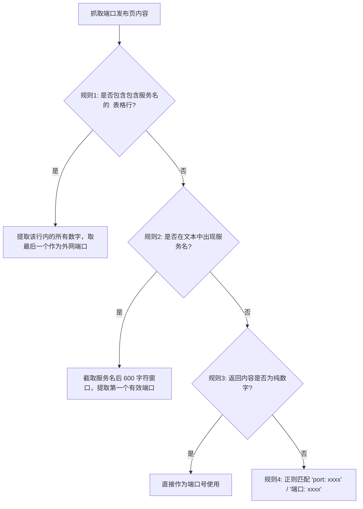

# EmbyPlayerNext

<div align="center">

-3DDC84?logo=android&logoColor=white)


-green)

**全能型 Android 原生 Emby 客户端（手机 · 平板 · TV 大屏完美适配）**  
*动态端口自动解析与故障自愈 · 瑞芯微(Rockchip等)电视芯片硬解兼容改造 · 自适应双视图排版 · Media3 强劲播放内核*

</div>

---

## 💡 为什么开发 EmbyPlayerNext？

在实际 Emby 远程串流与跨设备播放场景中，玩家常常面临两大核心痛点：

1. **公网端口漂移**：家庭宽带没有固定公网 IPv4，或者使用了动态端口映射、NAT 穿透、内网穿透（FRP / DDNS 端口定时变动）。一旦端口变化，所有手机、平板、电视客户端都需要手动重新修改服务器地址，极其繁琐，家人在设备端根本无法正常使用。
2. **TV 电视盒子/车机播放 4K 崩溃/黑屏**：市面上大量 Android 电视盒子、投影仪、车机采用国产 SoC（如**瑞芯微 Rockchip RK3588 / RK3399 / RK3568 / RK3328** 等）。原生 ExoPlayer / Media3 在调用硬件解码 4K H.265 (HEVC) 片源时，极易因异步队列阻塞或驱动不规范而发生**黑屏、卡死、声画脱节甚至应用崩溃闪退**。

**EmbyPlayerNext** 基于 Jetpack Compose 与 AndroidX Media3 架构重构，兼顾**手机流畅触控、平板大屏展开与电视遥控器交互**，并从底层针对上述两项核心痛点进行了系统级工程改造。

---

## 🌟 核心亮点一：动态端口自动解析与故障自愈（Auto-Port）

项目内置了高可用网络自愈模块 [`DynamicPortResolver`](app/src/main/java/com/embyplayernext/he/data/network/DynamicPortResolver.kt)。即使家庭服务端的映射端口频繁变更，客户端也能**全自动嗅探最新端口、热更新配置并自动重试**，全程无需人工干预。

### 1. 触发与工作机制
- **安全域名过滤**：支持设定目标域名（`Target Domain`），仅当当前连接的 Emby 服务器匹配该域名时才触发动态检测，避免误改其他固定服务器；
- **智能故障捕获**：当 App 在网络请求（登录、加载库、播放媒体等）中捕获到**网络超时、连接被拒、或 HTTP 502 / 503 / 504 错误**时，立即自动触发探测；
- **无感平滑自愈**：后台抓取配置的端口发布页 $\rightarrow$ 提取最新有效端口 $\rightarrow$ 热替换当前服务器地址中的端口并本地持久化 $\rightarrow$ 自动重试刚才失败的操作（或从当前进度重新建立播放会话）。

---

### 2. 动态端口解析规则详解（开发者指南）

客户端内置了宽松且精准的自适应解析规则，支持各种服务端发布形态。规则按以下优先级依次匹配：



#### 规则 1：HTML 表格行匹配（推荐，适合路由与穿透管理后台）
- 匹配页面中所有的 `<tr>...</tr>` 表格标签；
- 检查该行是否包含您配置的**服务名（Service Name，忽略大小写）**；
- 提取该行内所有有效端口（2~5位数字，范围 `1..65535`），并**取最后一个端口**作为目标端口。
> **设计原理**：路由器映射表或反代监控页通常排版为 `服务名 | 内网端口 | 外网映射端口`，提取每行最后一个数字能够准确锁定外网动态端口。

#### 规则 2：服务名文本窗口匹配（适合自定义监控/状态页）
- 若页面中非表格形式，但出现了配置的**服务名**；
- 自动截取服务名之后约 600 个字符的文本窗口，从中提取紧随其后的**第一个有效端口**。

#### 规则 3：纯文本/纯数字响应（最简微服务方式）
- 如果接口直接返回纯文本端口数字（例如响应体就是 `38291`），直接校验并使用。

#### 规则 4：常见键值对兜底
- 自动匹配形如 `port: 12345`、`"port": 12345`、`端口: 12345` 的文本格式。

---

### 3. 如何搭建自己的动态端口发布端？（示例）

您可以根据自己的部署环境选择以下任意一种方式提供端口页面，客户端均可自动解析：

#### 方案 A：极简纯文本 Web 接口（最简单）
使用 Python、Node.js、PHP 或 Go 编写一个微型接口，直接返回最新端口：
```python
# 例如 Python FastAPI / Flask / 静态文件
# 请求 GET http://your-domain.com:8080/port 直接返回：
38291
```
*App 端配置*：服务名留空或填任意字符均可。

#### 方案 B：返回带有服务名的 HTML 表格（适合多服务共用）
```html
<table>
  <tr>
    <td>emby-service</td>
    <td>8096</td>
    <td>38291</td> <!-- 客户端将精准提取此处的 38291 -->
  </tr>
</table>
```
*App 端配置*：抓取地址填页面 URL，服务名填 `emby-service`。

#### 方案 C：JSON 接口
```json
{
  "status": "ok",
  "emby": {
    "port": 38291
  }
}
```
*App 端配置*：服务名填 `emby`。

---

## 🎬 核心亮点二：瑞芯微等 TV 芯片硬件解码兼容深度改造

针对国产电视盒子与车机广泛使用的 **Rockchip (瑞芯微)** 平台，深入改写了底层渲染流水线（参见 [`RockchipDirectVideoRenderer.kt`](app/src/main/java/com/embyplayernext/he/playback/RockchipDirectVideoRenderer.kt) 与 [`RockchipHybridRenderersFactory.kt`](app/src/main/java/com/embyplayernext/he/playback/RockchipHybridRenderersFactory.kt)）：

### 1. 原厂 OMX 硬件解码通道直连
- **突破通用框架限制**：原生 Android MediaCodec 封装容易触发异步队列死锁。改造后的渲染器主动识别底层 `isRockchip` 芯片架构，优先激活芯片原厂硬件 OMX 解码器（如 `OMX.rk.video_decoder.hevc` 等）；
- **专用 Direct 渲染通道**：仅由直连通道管理关键的 `压缩数据 -> 原厂硬解 -> Surface 渲染` 链路，而音频轨、字幕轨、时钟同步、播放列表则无缝保留 Media3 官方统一调度，达到最佳视听同步表现。

### 2. 严密的动态三层降级（Fallback）链条
为杜绝电视端因异常码流导致的崩溃黑屏，播放器构建了全自动回退防护：
$$\text{Rockchip 原厂 OMX 直连硬解} \xrightarrow{\text{解码错误}} \text{Media3 官方标准硬解} \xrightarrow{\text{仍不支持}} \text{Jellyfin FFmpeg 软解扩展}$$

### 3. 低内存电视盒子（Low-RAM）自适应优化
- **防 OOM 缓冲策略**：自适应识别低运存设备，将预加载缓冲动态下调至 `8s ~ 30s`（正常设备 `15s ~ 60s`），显著降低 1G/2G 内存电视盒子的内存压力；
- **关闭不稳定隧道模式（Tunneling）**：针对大部分电视盒子魔改固件关闭音频 Tunneling，彻底根治因此导致的音画不同步问题。

### 4. 诊断日志一键导出
- 内置 `DiagnosticsLogger`，实时记录设备底层编解码器列表（MediaCodec List）、PTS 渲染统计、Rockchip 直连链路状态与错误回溯；
- 支持在设置页面一键导出为纯文本文件，排查设备兼容问题**完全无需连接电脑抓取 ADB 日志**。

---

## 📱 手机 · 平板 · TV 全场景优秀交互与媒体库体验

EmbyPlayerNext 是一套完整兼顾触控手机与大屏遥控器的多设备原生客户端：

- **全设备场景完美自适应**：
  - **手机触控端**：单手友好交互、底部快捷导航、横竖屏自适应、滑动手势快进/快退/亮度/音量控制、长按屏幕右侧临时 2x 倍速、双击两侧微步进跳播；
  - **平板与折叠屏端**：自适应左侧宽屏导航轨（Navigation Rail）、多列响应式网格与双列信息流；
  - **Android TV 大屏端**：D-Pad 遥控器边缘平滑焦点漫游、呼吸微动效高亮卡片边框、超宽比例防拉伸居中排版。
- **响应式媒体库布局**：
  - **自适应列数（Auto）**：手机 3 列、平板 4～5 列、电视 6～7 列，亦支持手动 2～8 列自由调节（独立持久化记忆）；
  - **双视图切换**：海报流网格与详尽列表视图（展示评分、时长、年份、流派与剧情简介）秒级切换；
  - **视觉徽章**：4K / 1080P / 720P 分辨率标签、金黄色社区评分徽章（`★ 8.5`）、未播集数统计胶囊；
  - **紧凑排版**：消除片名与年份之间的空白占位，单行片名自然紧凑对齐。
- **全生命周期 Media3 会话**：规范上报 Start / Progress / Stopped，支持 STRM 外链解析，杜绝脏进度污染服务器；
- **本地磁盘 LRU 缓存与 UI 缩放**：支持自定义缓存空间（0 ~ 512 MB），内置 85% ~ 160% 多档 DPI 缩放，轻松适配车机与各类定制显示设备。

---

## 🛠️ 本地编译与构建

### 环境要求
- **JDK**：Java 17 或 21
- **Android SDK**：API 35 (Android 15)
- **构建工具**：Gradle 8.11+ / AGP 8.7.3

### 编译命令

```bash
# 给予脚本执行权限
chmod +x gradlew

# 编译 Release 正式版 APK（推荐）
./gradlew assembleRelease

# 编译 Debug 测试版 APK
./gradlew assembleDebug
```

编译输出路径：
- Release APK: `app/build/outputs/apk/release/app-release.apk`
- Debug APK: `app/build/outputs/apk/debug/app-debug.apk`

### 覆盖安装说明

项目在 [`app/build.gradle.kts`](app/build.gradle.kts) 中已将 Release 和 Debug 均配置为使用内置的 [`app/ci-debug.keystore`](app/ci-debug.keystore) 签名：
- **证书所有人 (DN)**：`CN=EmbyPlayerNext CI Debug, O=EmbyPlayerNext, C=US`
- **签名保证**：重新编译生成的新版本 APK 签名与原包完全一致，**可直接在设备上覆盖安装升级，无需先卸载原应用**。

---

## 📄 开源依赖与鸣谢

本项目使用并遵循以下开源协议与优秀项目：
- [AndroidX Media3](https://github.com/androidx/media) - Apache 2.0
- [Jellyfin Media3 FFmpeg Decoder](https://github.com/jellyfin/jellyfin-androidtv) - GPLv3
- [Jetpack Compose](https://developer.android.com/jetpack/compose) - Apache 2.0
- [Coil](https://github.com/coil-kt/coil) - Apache 2.0
- [OkHttp](https://github.com/square/okhttp) - Apache 2.0
